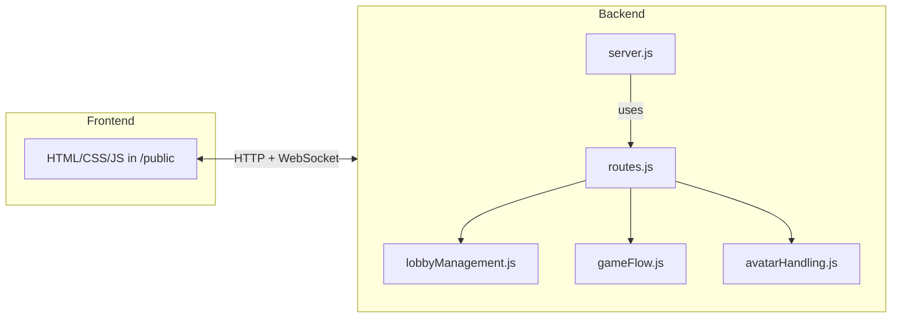
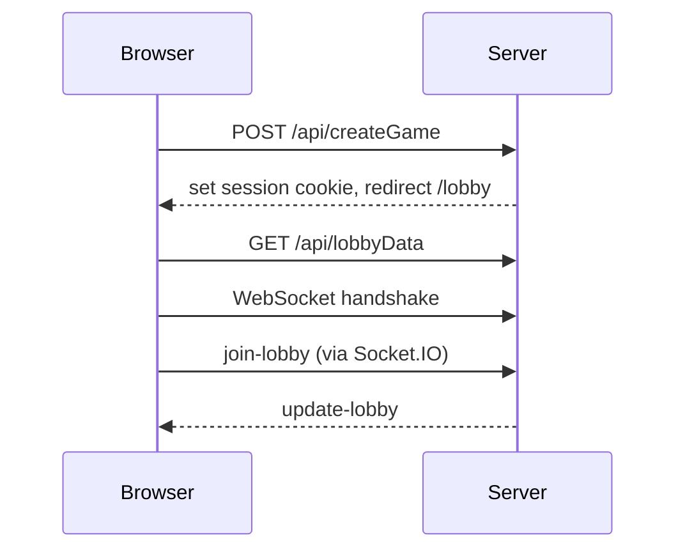

# Architecture Overview

This document outlines the high level structure of the UYES project. It briefly explains the backend modules, the static frontend and how both parts interact via Socket.IO.

## Backend Structure

The backend is a Node.js application using **Express**. The main entry point is `backend/server.js` which sets up middleware and binds Socket.IO. Application routes are declared in `backend/routes.js`. Game logic and lobby management live in the `backend/logic` folder:

- `lobbyHandling.js` creates new lobbies and generates player IDs.
- `lobbyManagement.js` keeps the lobby state and emits lobby related socket events.
- `gameFlow.js` contains the core gameplay logic such as dealing cards and handling turns.
- `avatarHandling.js` manages avatar images for the players.

Session data is stored as a signed JSON Web Token in a cookie. Helper functions in `jwtSession.js` read and write this cookie and an Express middleware attaches the decoded session to `req.session`.

During the Socket.IO handshake the session cookie is parsed manually so each socket knows the corresponding player ID and name.

## Frontend Structure

The frontend consists of static HTML pages under `public/html`. Each page loads scripts from `public/scripts` and styles from `public/styles`. After joining or creating a lobby, `public/scripts/gameplay.js` establishes the Socket.IO connection and handles real time events.

## Socket Flow and Session Handling

1. The client creates or joins a lobby via an HTTP request.
2. The server stores game ID and player information in the signed session cookie.
3. After loading the lobby page the client fetches `/api/lobbyData` and then opens a Socket.IO connection.
4. Socket messages such as `join-lobby`, `start-game` or `play-card` keep the game state synchronized across all connected clients.

Session information is available for HTTP routes through `req.session` and for sockets via `socket.data.session`, allowing the game logic to identify players and lobbies.

